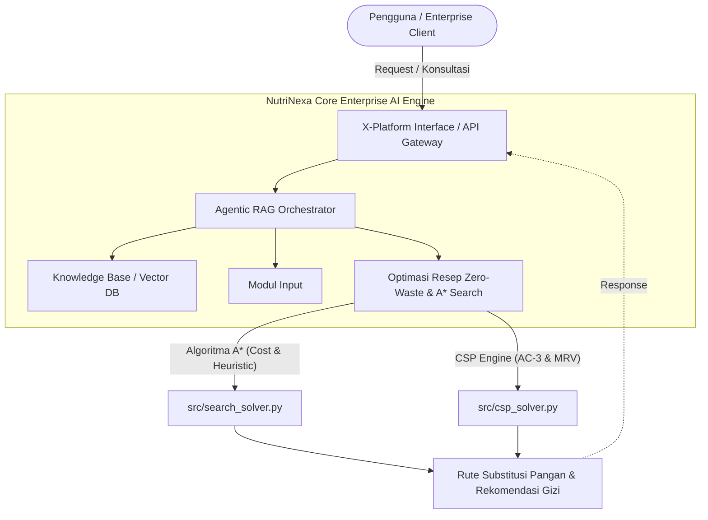

# NutriNexa (CERTAN-KEL-15)

NutriNexa (*Enterprise Food Waste & Recipe Optimizer*) adalah Sistem Informasi Cerdas Enterprise berbasis *Agentic RAG* yang dirancang untuk membantu pengelolaan bahan pangan, pencarian informasi SOP gizi, serta optimasi rekomendasi resep *zero-waste*.

NutriNexa mengintegrasikan beberapa komponen utama:
1. **Agentic RAG Orchestrator & Knowledge Base (Vector DB):** Untuk pencarian kontekstual dokumen SOP gizi internal.
2. **Modul Input Data Stok & Parameter Gizi:** Untuk pemrosesan data inventaris bahan pangan terstruktur (JSON/CSV) dan teks kueri interaktif.
3. **Baseline A* Search Engine (`src/search_solver.py`):** Algoritma pencarian berbasis *cost & heuristic* ($f(n) = g(n) + h(n)$) untuk menentukan rute substitusi bahan terhemat (Milestone 1).
4. **CSP Optimization Engine (`src/csp_solver.py`):** Mesin pemecah batasan berbasis *Constraint Satisfaction Problem* (AC-3 Propagation & Backtracking Search dengan MRV Heuristic) untuk menyusun alokasi menu harian yang patuh 100% pada batasan stok, alergi, dan batas kalori SOP (Milestone 2).

---

## 👥 Tim Pengembang (Kelompok 15)
- **AI Architect & Model Lead:** Choqy Pananda Sirait (12S24012)
- **Data & Knowledge Engineer:** Yesika Nadia Saragih (12S24024)
- **Integration & Interface Engineer:** Josua Sianturi (12S24035)
- **QA, Evaluation & Ethics Lead:** Jaya Bestina Simbolon (12S24023)

---

## 📐 Arsitektur Sistem (System Architecture)

Diagram arsitektur sistem NutriNexa menunjukkan integrasi antara antarmuka pengguna, *Agentic RAG*, *Modul Input*, serta mesin optimasi resep berbasis *A* Search* (`src/search_solver.py`) dan *CSP Solver* (`src/csp_solver.py`):



---

## 🔄 Alur Kerja Sistem (System Workflow)
1. Permintaan Pengguna: Pengguna atau pengelola katering memberikan request/konsultasi melalui antarmuka sistem (API Gateway/Gradio UI).

2. Orkestrasi Agentic RAG: Agentic RAG Orchestrator menerima permintaan dan menentukan sumber daya atau algoritma yang dibutuhkan.

3. Pencarian Pengetahuan (RAG): Knowledge Base / Vector DB menyediakan dokumen rujukan SOP gizi internal untuk menjamin validitas informasi.

4. Ingestion Modul Input: Modul Input membaca data stok inventaris terstruktur (JSON/CSV) serta kustomisasi diet/alergi pengguna.

5. Eksekusi Search & Optimasi:

    - A Search (src/search_solver.py):* Menghitung rute substitusi bahan baku dengan biaya terendah.

    - CSP Solver (src/csp_solver.py): Memangkas domain dengan AC-3 Arc Consistency dan mengeksekusi Backtracking MRV untuk memastikan kombinasi menu tidak melanggar  stok fisik, batas kalori, maupun alergi.

6. Umpan Balik (Response): Hasil rekomendasi resep zero-waste dan rincian gizi dikembalikan ke antarmuka pengguna secara instan.

---

## 🛠 Struktur Direktori Proyek
``` 
CERTAN-KEL-15/
├── .venv/               # Virtual environment otomatis dari Astral uv
├── docs/                # Berkas dokumentasi dan laporan teknis (PDF Milestone)
│   ├── Grup15-Tugas01.pdf
│   └──     .pdf
├── src/                 # Modul logika utama sistem
│   ├── search_solver.py # Skrip Baseline A* Search Engine (Milestone 1)
│   └── csp_solver.py    # Skrip CSP Optimization Engine AC-3 & MRV (Milestone 2)
├── tests/               # Berkas pengujian unit otomatis (pytest)
│   ├── test_search_solver.py # Pengujian unit A* Search
│   └── test_csp_solver.py    # Pengujian unit CSP & Kasus Ekstrem
├── .gitignore           # Konfigurasi pengisolasian file git
├── LICENSE              # Lisensi proyek (MIT License)
├── pyproject.toml       # Manifest dependensi Astral uv
├── README.md            # Dokumentasi utama repositori
└── uv.lock              # Berkas kunci versi dependensi uv
```

--- 

## 🚀 Setup & Eksekusi Proyek
Proyek ini mengadopsi manajer paket modern **Astral uv**

1. Clone Repositori

```
git clone [https://github.com/ChoqySirait/nutrinexa-enterprise-ai-KEL15Certan.git](https://github.com/ChoqySirait/nutrinexa-enterprise-ai-KEL15Certan.git)
cd nutrinexa-enterprise-ai-KEL15Certan
```

---

2. Sinkronisasi Dependensi

```
uv sync
```

---

3. Menjalankan Skrip Baseline A* Search

```
uv run src/search_solver.py
```

---


4. Menjalankan Seluruh Pengujian Unit Otomatis (pytest)

```
uv run pytest
```

---

